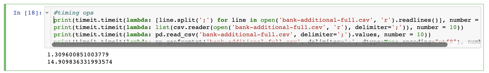
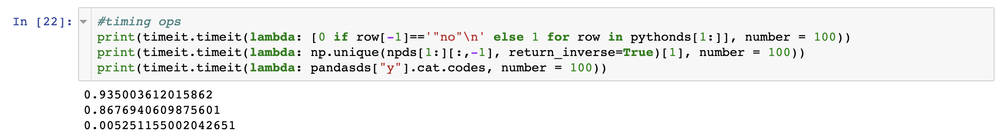
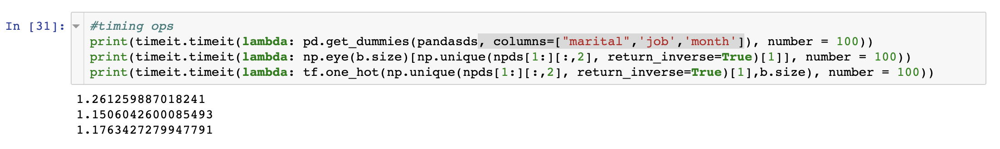

# Best Practices: Data Processing in Python

I was recently given a dataset and asked to build a Data Science presentation using it. This is happened a number of times in the past, and as in the past I immediately brought the dataset into Python and got it prepared to send through a neural network. There are a variety of ways and libraries to bring data into Python and pre-process it, but I have always stuck a single way of doing these tasks. I wanted to make sure the methods I use were the best, so I timed a variety of different ways to get data into Python and get it ready for a neural network, and wanted to share my findings as some best practices for data processing in Python.

## Loading Data - CSV to Python Data Structure
There are a many ways to get a csv into Python. Here I evaluate four: using Python, its csv library and the data processing libraries pandas and numpy.

## Preprocessing Data - Label Encoding
Label Encoding is important for data features that are binary categories. Neural networks cannot tell the difference between data label 'yes' and 'no,' but they are very good at differentiating betweeen 0's and 1's. Label encoding is the process of translating a data feature with two classes (such as 'yes' and 'no or ...) into data that a network can understand. I tried to label encode a feature of the dataset given to me three different ways by using Python, pandas, and numpy.

## Preprocessing Data - One-hot Encoding
If a data attribute has more than two classes, label encoding can still be used, but it does not makes sense for a neural network. For instance, if a field in a dataset is 'color' that can be one of three options (red, yellow, and blue), label encoding might assign a 0 for every red, 1 for every yellow, and 2 for every blue. 

## (Re)loading data - CSV to Pandas Dataframe

